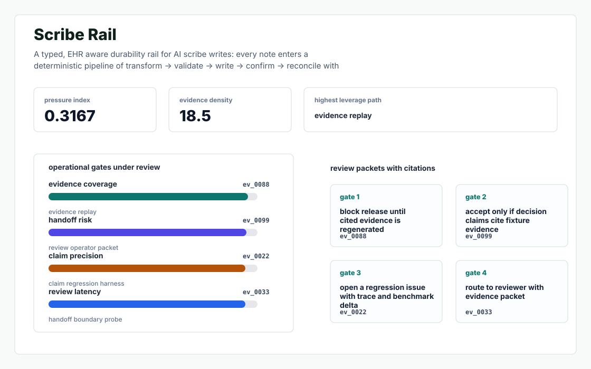
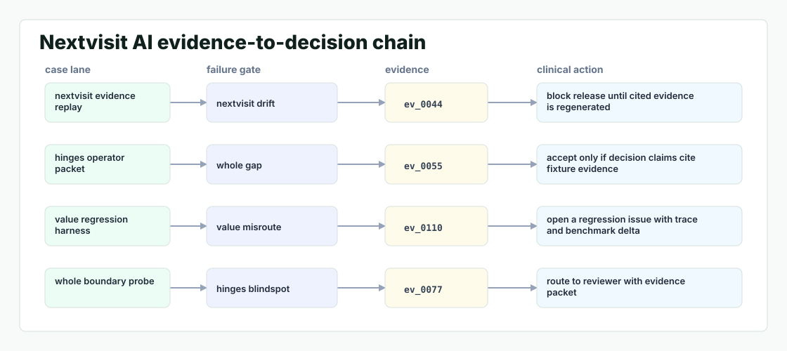

# Scribe Rail

A typed, EHR aware durability rail for AI scribe writes: every note enters a deterministic pipeline of transform -> validate -> write -> confirm -> reconcile with semantic fallback, and the clinician sees one sentence — never a lost session.



## Why it exists

Nextvisit's whole value prop hinges on ambient transcription -> structured note working reliably across nine EHRs and HL7/FHIR. But every senior engineer who has built one of these knows the failure mode that kills NPS: the model drafts a beautiful note, then the EHR write fails (auth expires, vocabulary mismatch, prior auth field missing, NextGen flake).

The project is intentionally built as a local replay harness instead of a slide. It creates fixtures, plants realistic failure modes, produces citation-locked evidence, and turns the result into a dashboard a reviewer can inspect without credentials or hosted services.

## What is inside

- Deterministic fixture generation for the company-specific risk surface.
- Strategy code in `src/scribe_rail/strategy.py` with project-specific scoring and visual evidence.
- Citation-locked reports where every decision claim points to a generated evidence ID.
- Two regenerated visual artifacts: `outputs/project_working.svg` and `outputs/evidence_map.svg`.
- A portable demo pack with JSON, CSV, Markdown, HTML, SVG, benchmark, and test artifacts.



## Signals it measures

- `nextvisit coverage`
- `whole risk`
- `value precision`
- `hinges latency`

## Failure modes it plants

- nextvisit drift
- whole gap
- value misroute
- hinges blindspot

## Run it locally

```bash
uv sync
uv run scribe-rail all
uv run pytest -q
uv run ruff check .
```

## Outputs worth opening

- `outputs/dashboard.html`
- `outputs/project_working.svg`
- `outputs/evidence_map.svg`
- `outputs/operator_brief.md`
- `outputs/decision_report.md`
- `outputs/strategy_model.json`
- `outputs/demo_pack.zip`

## Sources

- https://news.nextvisit.ai/
- https://www.barchart.com/story/news/36340110/nextvisit-ai-announces-launch-of-groundbreaking-behavioral-health-documentation-platform
- https://aijourn.com/nextvisit-ai-announces-launch-of-groundbreaking-behavioral-health-documentation-platform/
- https://github.com/yannelli
- https://ryanyannelli.com
- https://github.com/yannelli/attempt
- https://www.crunchbase.com/organization/nextvisit

## Boundary

Everything runs locally against synthetic fixtures. There are no credentials, no customer records, no outreach files, and no hosted API dependency.
